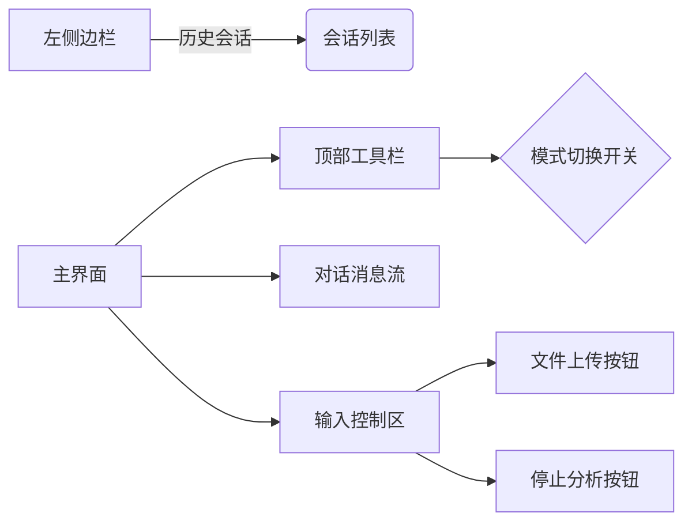
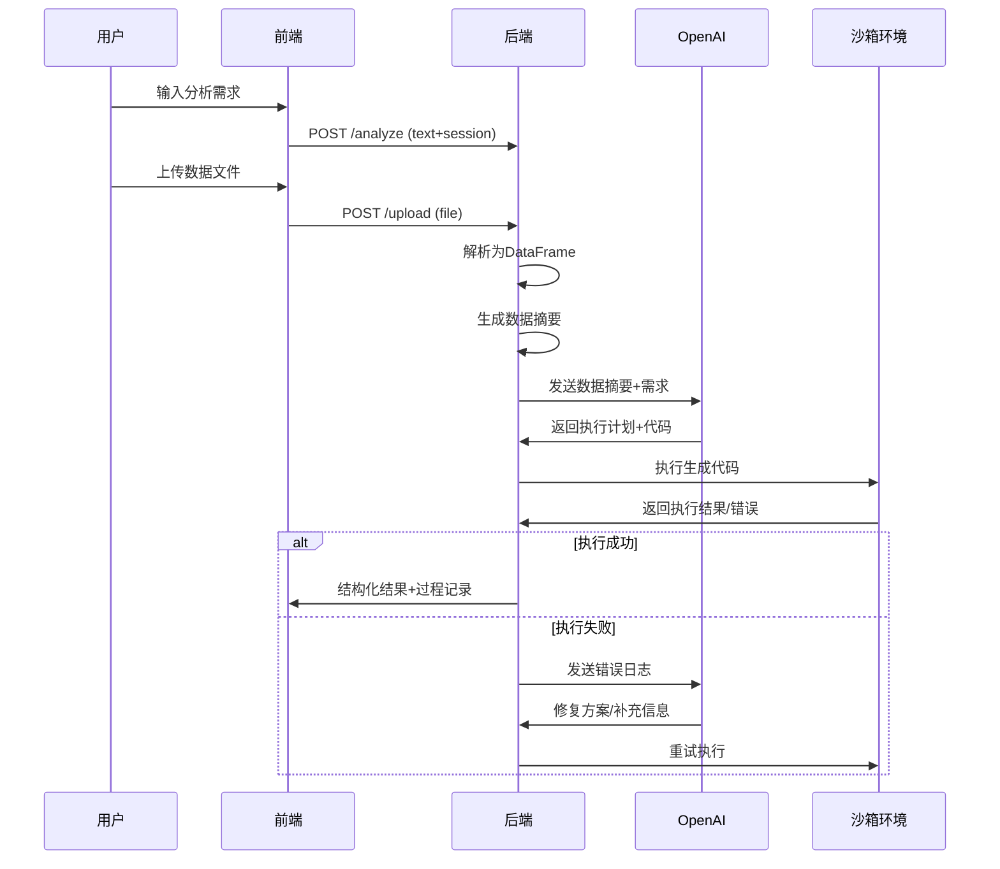
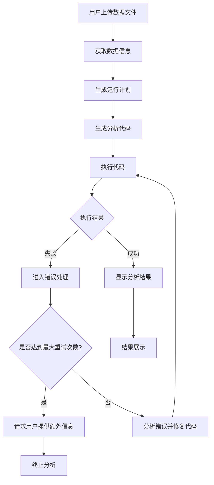

### 智能数据分析对话机器人产品需求方案

---

#### 一、产品核心定位
**智能对话式数据分析协作平台**  
面向非技术用户提供零代码数据分析能力，通过自然语言交互+大模型代码生成技术，降低数据洞察门槛，支持"专家/小白"双模式适应不同用户群体。

---

#### 二、核心功能矩阵
| 模块          | 功能要点                          | 技术指标                      |
|---------------|---------------------------------|-----------------------------|
| 对话核心       | 上下文感知对话、历史记录管理         | GPT-4 Turbo接口响应<3s       |
| 数据分析       | 文件解析、代码生成、沙箱执行         | 支持100MB以内CSV/Excel文件   |
| 执行环境       | 会话级环境共享、错误自修复机制       | 环境保持15分钟/最大5次重试   |
| 可视化展示     | 双模式结果呈现、过程追溯展示         | 表格渲染性能<500ms          |
---

#### 三、功能描述
**1. 总体功能描述**  
  用户可以在前端进行普通的对话， 如果用户上传数据文件之后， 可以在对话框描述自己的数据处理需求，后端接收请求之后, 通过与大模型交互，生成一句话的执行计划 和 代码，并执行，如果执行成功，则返回相应的表格结果。在前端有两种模式，专家模式下，显示 执行计划、生成的代码、返回的表格。小白模式下，只显示执行计划和返回的表格。  
  如果执行失败，后端将失败的信息与大模型交互，获取下一步解决方案，最终修复生成的代码，重新运行，返回给前端结果。小白模式下，只显示最开始的执行计划和最终的统计结果。专家模式下，显示全部的流程: 包括最开始的 执行计划、生成的代码、执行出错信息、大模型的处理方案、执行处理方案结果、大模型修复代码结果、最终运行结果。
  

**2. 功能需求**  

**2.1 聊天功能**  
- 功能描述: 用户可以与机器人进行聊天交互，聊任意的话题。
- 输入: 用户的想法
- 输出: 机器人的回应。(通过OPENAI的接口实现这一功能。) 


**2.2 数据流程**   

1. 数据上传
  - 功能描述：用户可以通过界面上传Excel或CSV文件。
  - 输入：用户选择文件并上传。
  - 输出：系统接收，将数据load进df中。
  
2. 数据信息提供与执行计划生成
  - 功能描述：在数据上传后，系统将数据的基本信息提供给大模型，模型将对数据情况进行总结，并生成执行计划和代码。
  - 输入：通过以下代码获取的数据基本信息：
 
		```python 
		# 查看数据的基本信息
		print('数据基本信息：')
		df.info()
		
		# 查看数据集行数和列数
		rows, columns = df.shape
		
		if rows < 100 and columns < 20:
		    # 短表数据（行数少于100且列数少于20）查看全量数据信息
		    print('数据全部内容信息：')
		    print(df.to_csv(sep='\t', na_rep='nan'))
		else:
		    # 长表数据查看数据前几行信息
		    print('数据前几行内容信息：')
		    print(df.head().to_csv(sep='\t', na_rep='nan'))
		```

  - 输出：大模型生成的执行计划和代码。
  
3. 代码执行
  - 功能描述：系统执行生成的代码。
  - 流程：
    1. 如果执行成功，进入步骤6。
    2. 如果执行失败，进入步骤4。
  
4. 错误处理与进一步计划
  - 功能描述：将执行信息提供给大模型，让其判断下一步计划。
  - 流程：
    1. 如果是获取额外信息，则生成相应的代码，继续执行，执行完毕后返回步骤4。
    2. 如果是直接修复原始代码，则生成相应修改后的原始代码，返回步骤3。
    3. 如果在此环节累计次数超过5次，则进入步骤5。
  
5. 用户通知与选择
  - 功能描述：告知用户错误次数过多，需要选择提供额外信息或结束。
  - 流程：
    1. 如果提供额外信息，则将其提供给大模型，进入步骤2，重新生成计划和代码。
    2. 如果结束，则进入步骤7。
  
6. 返回结果
  - 功能描述：将数据结果返回给用户。
  - 输出：返回结果通常是表格。
  
7. 结束对话
  - 功能描述：结束本轮对话。


**3. 界面展示**   
**3.1 双面板布局**  

**左侧历史面板**   
包括历史会话，会话列表。

**右侧工作区**   
从上到下包括顶部工具栏，对话消息流，输入框。  
顶部工具栏可以进行模式切换(小白、专家), 默认小白模式。  
输入框左侧有文件上传按钮，右侧有停止分析按钮，中间是输入框。  
 


**3.2 视觉要素**  
- **双模式差异**：

  ```diff
  + 专家模式：完整执行日志
  +         - 一句话的执行计划
  +         - 生成的代码
  +         - [出错情况下] 错误信息、大模型修复方案、获取信息代码、执行结果、大模型再次修复代码等，可以有多次，需要多个block.
  +         - 执行结果
  - 小白模式：一句话的执行计划、最终的执行结果。
  ```
  
  注: 执行结果以表格形式呈现。  
- **状态反馈**：
  - 执行中：进度条+动态图标  
  - 在运行过程中，将执行过程实时展示。  
     1. 小白模式将 模型的执行计划、最终返回的结果 实时展示。  
     2. 专家模式，将执行过程中进行的步骤实时进行展示。  


**4. 会话要求**  

1. 共享执行环境：  
  - 在同一个会话中，执行环境应能够共享，以避免重复加载数据。用户在进行多次分析时，可以在前一次分析的基础上继续进行，提升效率。
2. 会话存留时间：  
  - 每个会话的存留时间为15分钟。在此时间内，用户可以随时返回并继续之前的分析，而不需要重新加载数据或重新开始会话。  
3. 同时可以支持100个用户进行数据分析。 
  
---

#### 四、全流程交互设计


##### 运行逻辑流程


---

#### 五、用户体验

- 界面应简洁明了，操作流程应流畅，用户能够轻松找到所需功能。
- 提供清晰的提示和反馈，确保用户在分析过程中能够理解每一步的操作和结果。
- 在用户输入新的需求时，系统应能够智能识别上下文，提供相关的建议和参考信息。

#### 六、测试与验证
- 在开发完成后，进行全面的测试，包括功能测试、界面测试和性能测试，确保系统稳定可靠。
- 收集用户反馈，持续优化系统功能和用户体验。

**1. 核心测试用例**  

| 测试类型       | 测试场景                      | 预期结果                    |
|---------------|-----------------------------|---------------------------|
| 边界测试       | 上传100MB CSV文件             | 30秒内完成解析             |
| 错误恢复       | 连续6次代码执行失败           | 触发用户干预流程           |
| 安全测试       | 注入危险代码`rm -rf /`        | 沙箱拦截执行并报错         |
| 压力测试       | 100并发会话请求               | 平均响应时间<2秒           |

