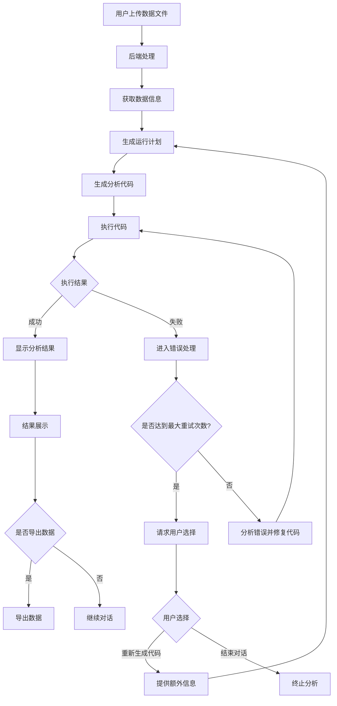

# 智能数据分析对话机器人产品需求规划方案

## 一、产品定位
**智能对话式数据分析协作平台**  
面向非技术用户提供零代码数据分析能力，通过自然语言交互+大模型代码生成技术，降低数据洞察门槛，支持"专家/小白"双模式适应不同用户群体。

## 二、技术架构
### 1. 前端架构 (React.js)
```
frontend/
├── src/
│   ├── components/          # 可复用组件
│   │   ├── Chat/           # 聊天相关组件
│   │   ├── FileUpload/     # 文件上传组件
│   │   ├── ResultDisplay/  # 结果显示组件
│   │   └── common/         # 通用组件
│   ├── pages/              # 页面组件
│   │   ├── Home/          # 主页
│   │   └── Analysis/      # 分析页面
│   ├── services/          # API服务
│   │   ├── chat.js        # 聊天服务
│   │   ├── file.js        # 文件服务
│   │   └── analysis.js    # 分析服务
│   ├── store/             # 状态管理
│   │   ├── chat.js        # 聊天状态
│   │   ├── file.js        # 文件状态
│   │   └── analysis.js    # 分析状态
│   ├── utils/             # 工具函数
│   └── constants/         # 常量定义
```

### 2. 后端架构 (FastAPI)
```
backend/
├── app/
│   ├── api/               # API路由
│   │   ├── chat.py       # 聊天API
│   │   ├── file.py       # 文件API
│   │   └── analysis.py   # 分析API
│   ├── core/             # 核心功能
│   │   ├── config.py     # 配置管理
│   │   └── security.py   # 安全相关
│   ├── services/         # 业务服务
│   │   ├── chat.py       # 聊天服务
│   │   ├── file.py       # 文件服务
│   │   └── analysis.py   # 分析服务
│   ├── models/           # 数据模型
│   │   ├── chat.py       # 聊天模型
│   │   └── file.py       # 文件模型
│   ├── utils/            # 工具函数
│   └── schemas/          # Pydantic模型
```

### 3. 大模型集成
```
backend/
├── app/
│   ├── services/
│   │   └── llm/          # 大模型服务
│   │       ├── openai.py # OpenAI接口
│   │       ├── prompt.py # 提示词管理
│   │       └── utils.py  # 工具函数
```

## 三、核心功能模块
### 1. 对话核心
- 上下文感知对话
- 历史记录管理
- GPT-4 Turbo接口响应<3s

### 2. 数据分析
- 文件解析（CSV/Excel）
- 代码生成
- 沙箱执行
- 支持100MB以内文件

### 3. 执行环境
- 会话级环境共享
- 错误自修复机制
- 环境保持30分钟
- 最大5次重试

### 4. 可视化展示
- 双模式结果呈现
- 表格渲染性能<500ms

## 四、详细功能需求
### 1. 文件处理
- 支持CSV和Excel格式
- Excel文件仅支持单个sheet页
- 文件大小限制：100MB
- 文件解析性能：30秒内完成
- 暂不显示文件基本信息（预留功能）

### 2. 数据分析流程


### 3. 界面设计
#### 3.1 双面板布局
- 左侧：历史会话列表
- 右侧：工作区
  - 顶部工具栏（模式切换）
  - 对话消息流
  - 输入控制区

#### 3.2 双模式展示
- 专家模式：
  - 执行计划
  - 生成的代码
  - 错误信息（如果有）
  - 修复方案（如果有）
  - 执行结果
- 小白模式：
  - 执行计划
  - 最终结果

### 4. 会话管理
- 会话保持时间：30分钟
- 支持会话导出
- 支持100个并发用户

### 5. 错误处理
- 支持用户手动中断分析
- 最多5次自动重试
- 超过5次后请求用户选择：
  - 提供额外信息重新生成代码
  - 结束对话

## 五、技术指标
1. 性能指标
   - 文件解析：100MB文件30秒内完成
   - 表格渲染：性能<500ms
   - 并发支持：100个用户
   - 平均响应时间：<2秒

2. 部署要求
   - 支持私有化部署
   - 支持Docker容器化

## 六、数据安全与存储
- 不需要加密存储
- 不需要数据脱敏
- 需要持久化存储用户会话数据

## 七、预留功能
1. 前端显示文件信息
2. 数据预览功能
3. 数据统计功能
4. 数据可视化功能
5. 数据分析模板
6. 会话分享功能 